# eRTMAC-NWIS: Nearby Wells Intelligence System

**SIH 2026 · PS 26121 · Oil India Limited.** An AI-powered offset-well knowledge and decision-support platform that runs alongside eRTMAC.

NWIS turns decades of DDRs, WCRs and scanned reports into **cited, structured drilling knowledge**. It then uses that knowledge to warn the rig **before** the bit reaches a problem interval, by projecting offset-well events onto the active well **by formation, not measured depth**.

> ⚠️ **All data in this repository's demo is SYNTHETIC.** It is generated from published Upper-Assam geology (Girujan clay, depleted Tipam sands, Barail coal and thrust-proximal overpressure, fractured Sylhet limestone). Well names are fictitious. A **real public-data mode** (Norwegian North Sea, Sodir FactPages, open licence) is one click away in **System → Dataset**; where OIL's own data would come from, and how to request real Assam well data from DGH's National Data Repository, is in [`docs/DATA_SOURCES.md`](docs/DATA_SOURCES.md).

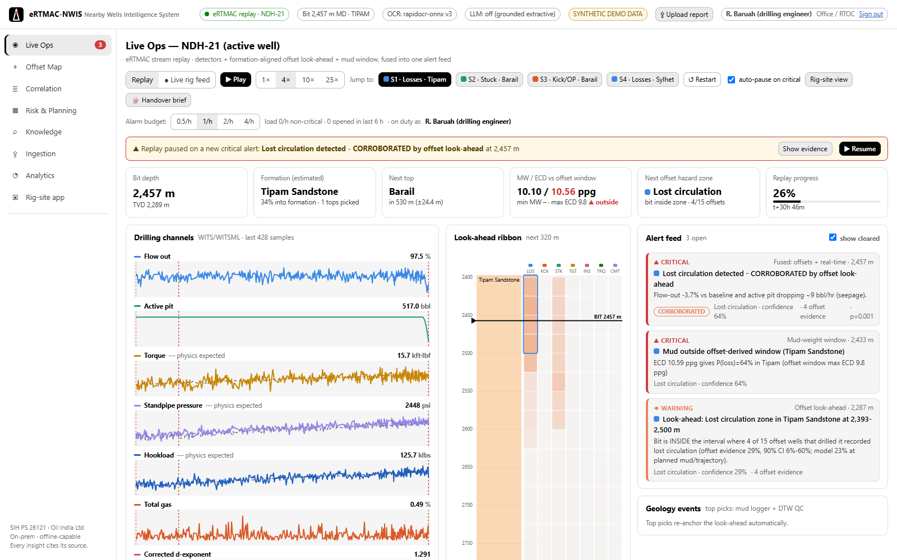

## Why it's different

| | Typical offset tools | **NWIS** |
|---|---|---|
| Offset comparison | by MD / TVD | **by formation**: tops interpolated with ±σ and re-anchored live as tops are picked |
| Risk | score, no uncertainty | **probability, 90% credible interval and evidence count** (Beta-Binomial) plus an ML model; beats "look at the nearest well" (AUC 0.89 vs 0.59) |
| Mud weight | fixed program | **offset-derived, depletion-aware MW/ECD window**: P(loss\|ECD), P(kick\|MW) |
| Alerts | "something is wrong" | **fused and corroborated**: the source page, what worked last time (case-mix-adjusted cure rates) and analog situations; physics-expected baselines; an RTOC-set **alarm budget** with a visible digest |
| Accountability | none | **decision black box**: hash-chained log of every alert shown, who acknowledged it and what they said |
| Legacy knowledge | digital data only | **NLP + OCR** over DDR/WCR PDFs and scans, with negation, units, citations and a review queue; **expert memos** (typed or voice), **after-action reviews** and cited **shift handovers** |
| Access | shared logins | **sign-in with field / office / admin roles**, enforced on every API call; the decision log names the signed-in person |
| Deployment | cloud SaaS / licences | **on-prem, air-gapped, open source**; WITS-0 and WITSML adapters for eRTMAC |

Full rationale: [`docs/VISION.md`](docs/VISION.md) (end goal, success metrics, staged path) · [`docs/DATA_SOURCES.md`](docs/DATA_SOURCES.md) (data sources, public stand-ins, DGH NDR guide) · [`docs/RESEARCH.md`](docs/RESEARCH.md) (market and literature) · [`docs/SOLUTION.md`](docs/SOLUTION.md) (design, metrics, demo script, roadmap).

## Quick start: no commands needed

Requirements: Python 3.10+ and Node 18+ (Node is used once, to build the dashboard).

1. **Start NWIS.** Windows: double-click **`start.bat`**. Linux / macOS: run `./run.sh`. The first start installs what NWIS needs, then opens **http://localhost:8000** in your browser. Keep the window open while you use NWIS.
2. **Build the knowledge base in the browser.** On first start the page offers the datasets. Click **Build knowledge base** for the synthetic Upper-Assam demo and watch it generate the wells, read every report (NLP + OCR), train the models and replay the active well (about 5–8 minutes). The dashboard opens by itself when it is ready.
3. **Sign in** as `field`, `office` or `admin` (password `demo`).

From then on everything is done in the dashboard:

| What | Where in the dashboard | (was) |
|---|---|---|
| Build / rebuild the knowledge base, with live progress | first-run page · **System → Dataset** | `nwis.cli build-demo` |
| Real public North Sea data (Sodir), download or upload the CSV exports; switch datasets | **System → Dataset** | `build-public`, `NWIS_REGION`, `NWIS_DATA_DIR` |
| Connect the live rig feed: WITS-0 (listen or connect) or a WITSML server | **System → Live rig feed** | `NWIS_STREAM` |
| Simulated rig sending real WITS-0 frames, from spud or a scenario (S1–S4) | **System → Rig simulator** | `nwis.cli simulate-rig` |
| Import many reports: several files, a folder or a .zip | **Ingestion → Bulk import** | `nwis.cli import-volve` |
| Real-data check on the Equinor Volve reports (upload XML or .zip) | **Analytics → Real-data check** | `nwis.cli validate-volve` |
| Re-run the live-alerting evaluation | **Analytics → Alarm budget** | `nwis.cli evaluate-live` |
| Upload reports from any view: one file, many files or a whole folder | **⇪ Upload report** (top bar, office and admin) | `POST /api/ingest` |
| Read scans that were stored unread before OCR was installed | **Ingestion → Read them now** | `nwis.cli reread-scans` |
| Re-score OCR, retrain the risk model, retrain the sentence classifier from review verdicts | **Analytics → Maintenance** (office) | `nwis.cli evaluate-ocr`, `retrain-risk`, `retrain-classifier` |
| Start / stop the rig simulator without leaving the console | **Live Ops → Rig simulator** (admin, live feed) | `nwis.cli simulate-rig` |
| Top-pick mode, stream-gap alarm, on-prem LLM (with connection test), voice model, map tiles | **System → Settings** | `NWIS_TOP_PICK`, `NWIS_LLM`, `OLLAMA_*`, `NWIS_ASR_MODEL`, `NWIS_TILE_*` |
| Install the OCR or speech-to-text engine | **System → Optional engines** | `pip install "nwis[ocr]"` / `"nwis[asr]"` |
| Sign-in on/off, users and roles | **System → Access & users** | `NWIS_AUTH` |
| Restart the server; background jobs and their logs | **System → Server** | — |

A rebuild runs next to the knowledge base in use and is swapped in only when it has finished cleanly; people's accounts and the decision log are kept. Settings are saved in `nwis_settings.json` and survive restarts. Maintenance jobs are recorded in the decision log under the name of whoever started them. An environment variable, if set, still takes precedence; the dashboard then shows that setting as locked.

Sign-in is on by default. A `field` account (rig site) sees Live Ops, the rig view, map, correlation, risk, knowledge and memo capture. `office` (RTOC, drilling engineer) adds ingestion, the review queue, after-action approval, the what-if planner and Analytics. `admin` adds **System** and user management.

<details><summary>For developers and automation: the same operations from the command line</summary>

```bash
./run.sh --dev                              # backend :8000 + Vite hot-reload :5173
cd backend && python -m nwis.cli build-demo # build the synthetic knowledge base without the browser (CI)
python -m nwis.cli serve                    # the server without the restart supervisor
python -m nwis.cli import-volve DIR | validate-volve DIR | evaluate-live | metrics
NWIS_REGION=norway NWIS_DATA_DIR=../data_norway python -m nwis.cli build-public --download --quadrants 15,16
python -m nwis.cli reread-scans | evaluate-ocr | retrain-risk | retrain-classifier
python -m nwis.cli simulate-rig --connect 127.0.0.1:5501 --speed 600
pip install -e "backend[asr]"               # optional speech-to-text for voice memos
```
The `[ocr]` extra installs `rapidocr-onnxruntime` 1.x on Python ≤ 3.12 and its successor `rapidocr` 3.x on 3.13+. Both bundle their models in the wheel, so OCR runs offline. Installed OCR after the build? No rebuild is needed: re-read the stored scans from Ingestion and re-score OCR from Analytics → Maintenance.

Live-feed specs (`NWIS_STREAM`): `replay`, `wits0-listen:5501`, `wits0-connect:HOST:PORT`, `witsml:https://store/…?well=W&wellbore=WB&log=L`. The rig-site tablet app is at `/#/rig`; it is installable and keeps the last picture when the link drops. Where OIL's own data would come from, and how to request real Assam well data from DGH's National Data Repository, is in [`docs/DATA_SOURCES.md`](docs/DATA_SOURCES.md).
</details>

## The views

| View | What to show |
|---|---|
| **Live Ops** | Replay of the active well NDH-21's eRTMAC stream. "Jump to" S1–S4 scenarios. Fused alert feed with p-values, look-ahead ribbon, physics-expected lines, alarm budget and digest, evidence drawer with citations and decision log, DTW top-pick QC, shift-handover brief, rig-site view. |
| **Offset Map** | Wells within a user-defined radius, coloured by dominant hazard. Click anywhere to assess a planned location. |
| **Correlation** | Offset logs side by side; flatten on a formation top and the Tipam thief sand lines up. |
| **Risk & Planning** | Depth × hazard risk with CIs, headline zones, MW window vs plan, **what-if planner** (MW / ECD / casing points), printable Offset Hazard Brief. |
| **Knowledge** | Search with auto-parsed filters and **CSV export** of every match with its source page, **Browse all** events and lessons, "Ask NWIS" with numbered citations, knowledge graph (what cured what), **after-action review** on any event. |
| **Ingestion** | Upload PDF/XML or use a sample; **bulk import** of a folder, many files or a .zip. Sentence-level NLP trace, extracted events, human review queue with history (approved / rejected), **expert memo** capture with peer review. Scans stored before OCR was installed are flagged, with a one-click re-read. |
| **Analytics** | Model skill vs baselines, extraction F1, NPT Pareto, calibration, what-if value, alarm-budget trade-off (re-run in place), DTW top-pick accuracy, Volve real-data check (upload in place), **Maintenance** (re-score OCR, retrain the risk model and the sentence classifier), decision-log browser and verification. |
| **System** (admin) | Dataset build / switch, live rig feed and rig simulator, settings, optional engines, users, restart, background jobs. |

<details><summary>More screenshots</summary>

| | |
|---|---|
| 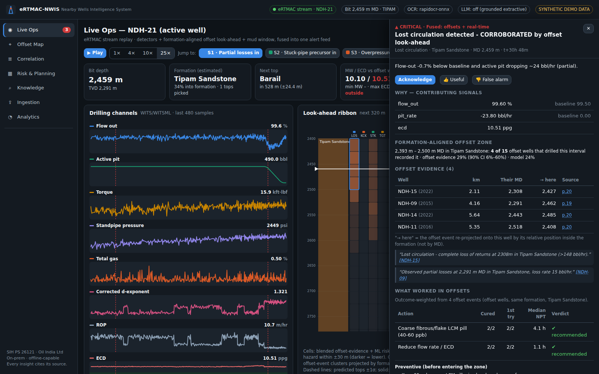 | 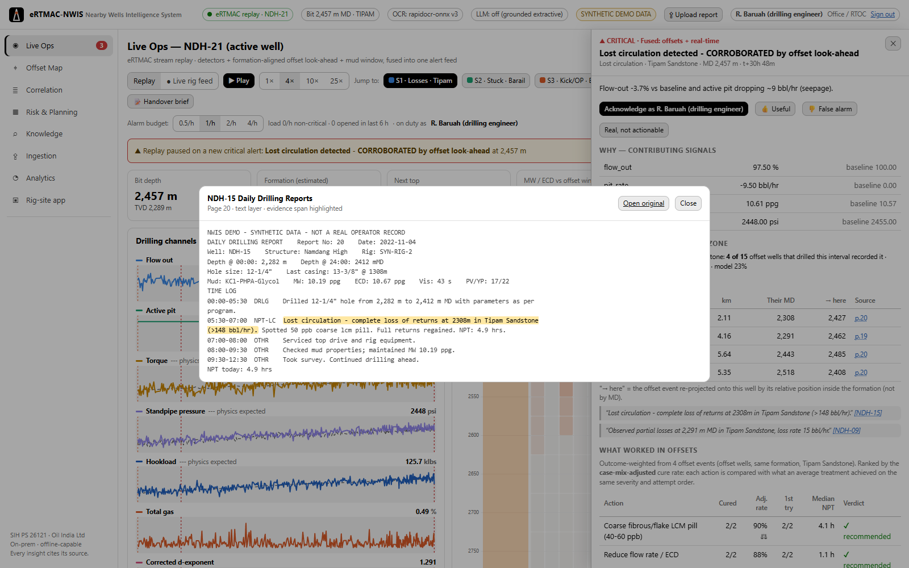 |
| 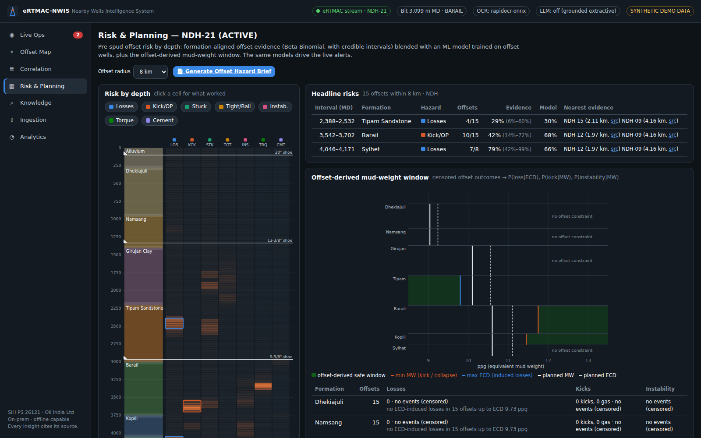 | 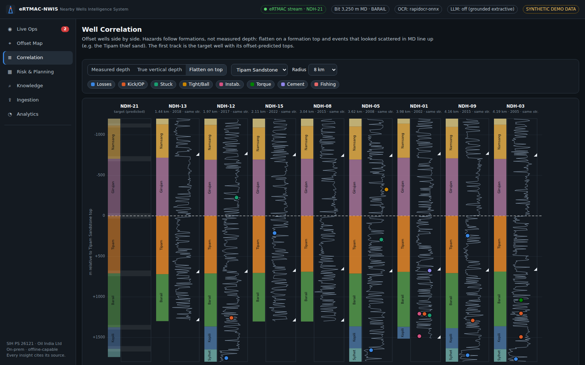 |
| 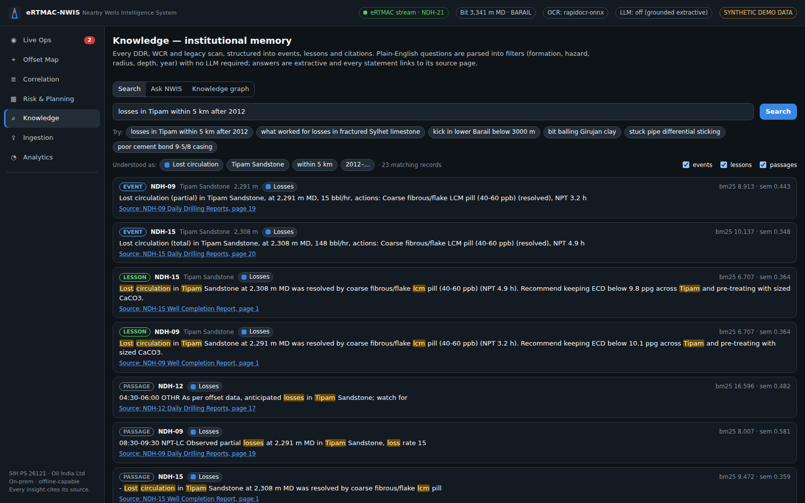 | 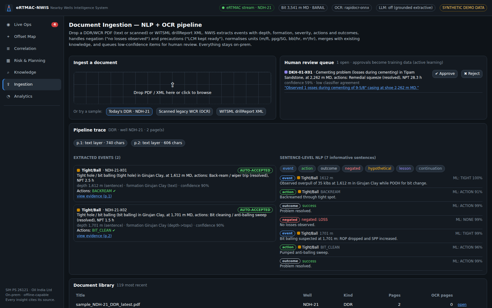 |
| 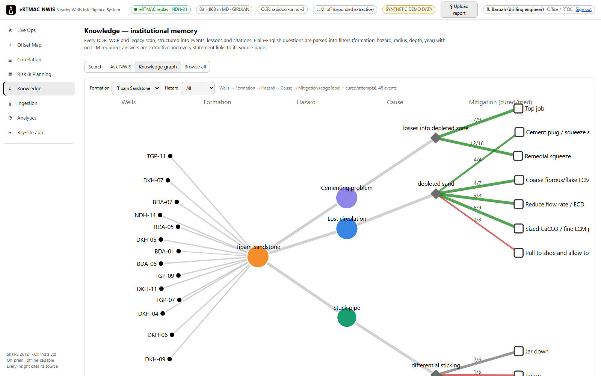 | 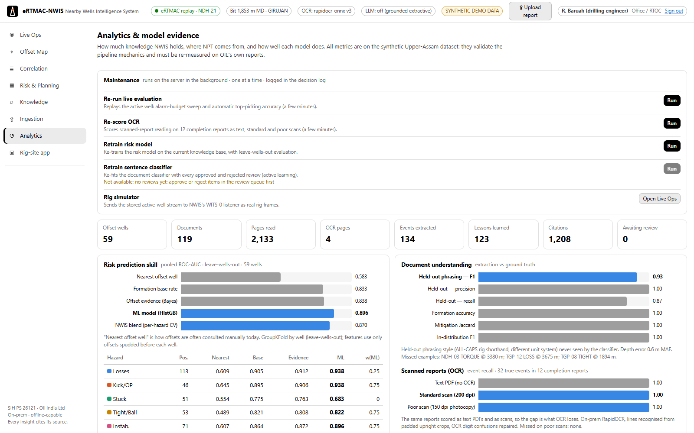 |
| 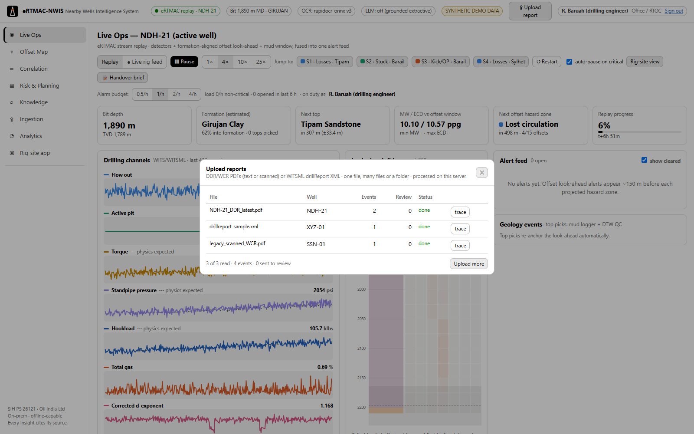 | 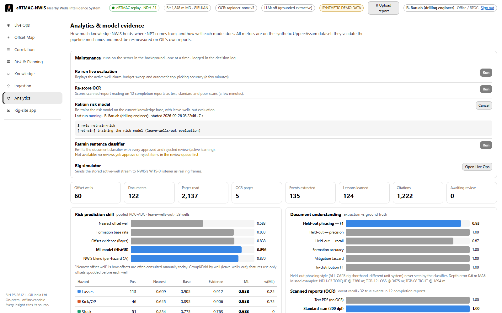 |
| 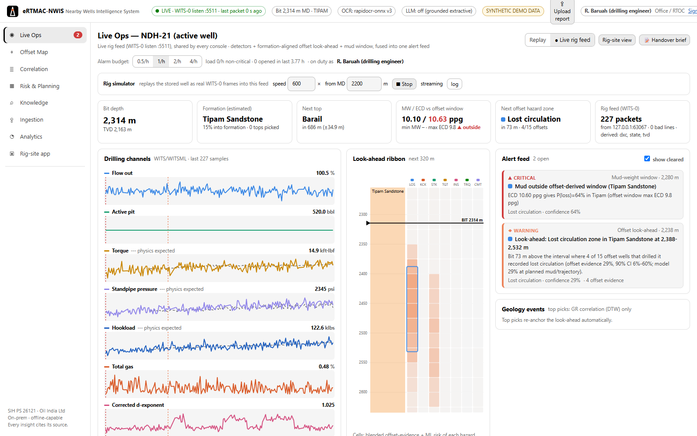 | 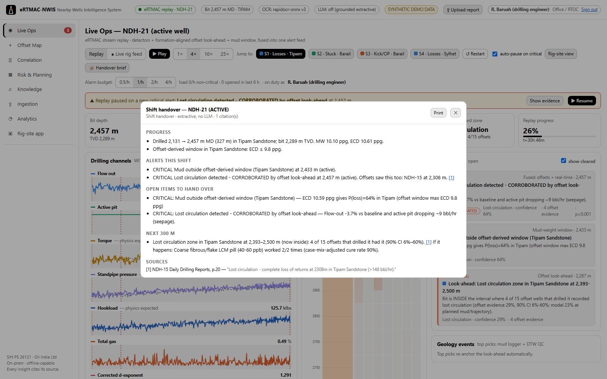 |
| 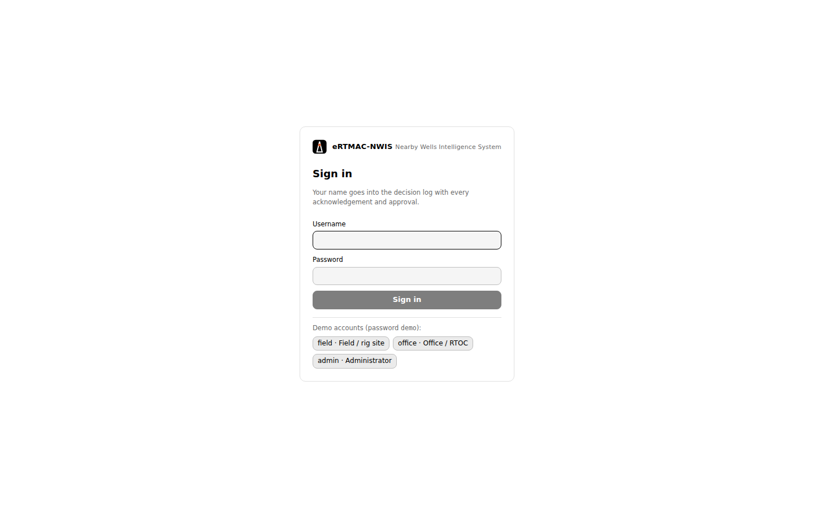 | 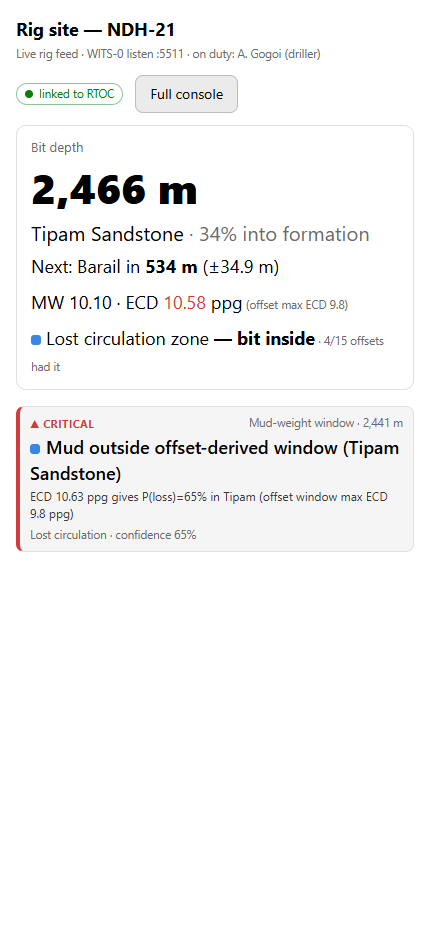 |
</details>

## Repository layout

```
backend/nwis/
  domain/ontology.py      formations, hazards, mitigations, negation/hypothetical lexicons
  data/                   synthetic Upper-Assam world, DDR/WCR PDF renderer, drilling logs + active-well stream
  ingest/                 PDF/OCR, NLP extraction, pipeline + review queue, WITSML + WITS-0, evaluation
  correlation.py          IDW tops, formation-relative projection, correlation panel
  risk/                   Beta-Binomial ribbon + zones, HistGB model (leave-wells-out), MW window, case-mix-adjusted recommendations, what-if
  search/                 query parser, BM25 + LSA + RRF index, Ask NWIS
  realtime/               detectors, physics baselines, conformal alarm budget, DTW top picking, alert fusion, analog replay, live engine, replay evaluation
  kg.py report.py llm.py  knowledge graph, Offset Hazard Brief, optional Ollama with citation guard
  memory.py audit.py      shift handover + after-action reviews; hash-chained decision log
  auth.py                 sign-in (PBKDF2 + signed cookie) and the field / office / admin access policy
  jobs.py ops.py          background jobs (log + progress in the page); staged builds, dataset switch, restart, rig simulator, installs
  realtime/sources.py hub.py simulator.py   WITS-0 TCP / WITSML sources, shared live session, rig simulator
  validate/volve.py       real-data check on the public Equinor Volve reports
  public/sodir.py         real public-data build from Sodir FactPages (North Sea wells, tops, casing, mud, LOT/FIT, histories)
  api/main.py             FastAPI REST + /ws/live WebSocket, serves the UI
backend/tests/            80 tests (NLP, OCR, geometry, parsers, model claims, live replay, API, sign-in and roles, vision features, live feed, public-data validation, dashboard operations)
frontend/src/             React + TypeScript views and components
docs/                     VISION.md, RESEARCH.md, SOLUTION.md, DATA_SOURCES.md, screenshots
```

## Tests

```bash
cd backend && pytest -q    # unit tests always run; system tests run once a knowledge base has been built
```
