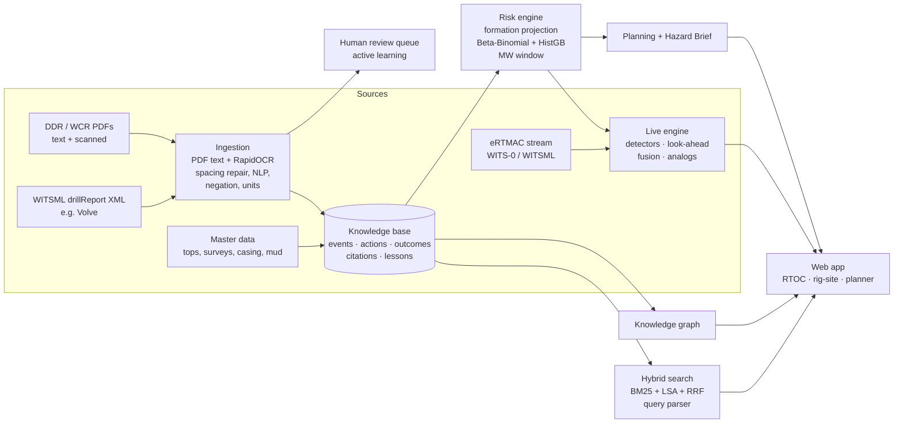

# eRTMAC-NWIS: Solution Design

**Nearby Wells Intelligence System: offset-well institutional memory that speaks up *before* the bit gets there.**
SIH 2026 · Problem Statement 26121 · Oil India Limited · Smart Automation

> **In one line:** NWIS reads every DDR, WCR and legacy scan, turns them into cited events, and projects the offset wells' problems onto the active well **by formation, not measured depth**. Engineers get a warning ~150 m ahead, with the source page, and a ranked list of what actually worked last time.

See [`RESEARCH.md`](RESEARCH.md) for the market and literature analysis that drove these choices.

---

## 1. Who uses it, and for what

| User | Question they have today | What NWIS gives them |
|---|---|---|
| **RTOC / eRTMAC engineer** | "Is this flow-out drop the Tipam thief sand the offsets talked about?" | One fused alert feed: real-time detectors, formation-aligned offset look-ahead and mud-window checks. Each alert carries offset evidence, source pages and analogs. |
| **Rig-site company man** | "What do I do *now*?" | Rig-site view: bit depth, formation, one big alert, and the top actions with their historical cure rate. |
| **Well planner** | "What will this location throw at us, section by section?" | Risk-by-depth ribbon with credible intervals, the offset-derived mud-weight window, predicted tops ±σ, and a printable Offset Hazard Brief (DWOP pack). |
| **Knowledge owner** | "Where is that 2009 report about the Sylhet losses?" | Search and Ask with automatic filter parsing, a knowledge graph, and a review queue for low-confidence extractions. |

## 2. Architecture

- **Backend:** Python 3.11 with FastAPI, REST plus a WebSocket at `/ws/live`.
  - Storage is SQLite, so there's nothing to install for the demo; PostgreSQL + PostGIS in production.
  - Analytics libraries: scikit-learn, SciPy, NumPy.
  - PDF handling is PyMuPDF. OCR is RapidOCR (ONNX, pip-only), with Tesseract as a fallback.
- **Frontend:** React 18 + TypeScript (Vite), Leaflet for the map, custom SVG charts, and d3-force for the graph.
- **Air-gapped by design:** no cloud APIs. The optional LLM is a local Ollama, off by default. It may only rephrase retrieved facts, and a **citation guard** drops any sentence without a valid citation.

## 3. What makes it different (and how each piece works)

### 3.1 Formation-aligned look-ahead
Hazards live in formations, whose tops shift by hundreds of metres across structures. The look-ahead works in four steps:
1. **Interpolate tops.** The target's tops are interpolated from offsets using inverse-distance weighting, `w = 1/(d² + 0.25)`. Uncertainty is `σ = weighted spread + 6 m + 3 m·d_min`.
2. **Project each offset event.** An event at relative position `r` inside formation F is placed at `top'(F) + r·thickness'(F)`.
3. **Convert to MD.** The projected TVD becomes MD along the planned trajectory, using minimum curvature.
4. **Cluster and score.** Projected events are clustered into **zones**. Each zone's probability is the weighted share of *exposed* offsets that had the hazard.

While drilling, each penetrated top is picked (mud-logger style, with lag) and everything deeper is re-anchored. In the demo, the Tipam top came in 11 m off prognosis and the look-ahead shifted automatically.

### 3.2 Uncertainty-aware risk ribbon
For each 25 m bin and each hazard:
- The prior is `Beta(2·p₀, 2·(1-p₀))`, where `p₀` is the basin rate for that formation window.
- **Weights:** each offset's weight is its distance kernel `exp(-d/3.5 km)`, times 1.5 if it's in the same structure, times recency `0.35 + 0.65·exp(-age/15 y)` (Tipam depletion makes newer wells more relevant), times data quality.
- **Censoring:** only offsets that **drilled that interval** count as exposures. A well that stopped above it tells you nothing.
- **Output:** the mean, a 90% credible interval, and the evidence count, so thin evidence *looks* thin.

A HistGradientBoosting model is stacked on top. It uses evidence features plus planned MW/ECD, inclination, mud system, spud year and distance to the Naga thrust. The blend weight between evidence and model is chosen per hazard by cross-validation. Occlusion explanations give the drivers, e.g. "mud weight/ECD +68 pts".

### 3.3 Probabilistic, offset-derived mud-weight window
Offset outcomes are censored pressure evidence:
- losses at ECD x ⇒ loss gradient ≤ x
- no losses ⇒ loss gradient > x
- kicks at MW x ⇒ pore pressure ≥ x

Weighted logistic curves per formation give `P(loss | ECD)`, `P(kick | MW)` and `P(instability | MW)`. The loss curve is **depletion-aware** because spud year is a covariate, and it is evaluated at the target's year. Losses to natural fractures or unconsolidated sand are separated out and flagged "not MW-controlled: plan LCM". The live engine checks the current MW/ECD against this window.

### 3.4 Physics-informed real-time detectors
Each detector reports the channels that drove it:

| Detector | Signals |
|---|---|
| Kick | Flow-out delta over baseline (the earliest indicator), pit-gain trend over 15 minutes, gas, pump-state gating |
| Losses | Flow-out drop plus pit-loss rate, classed as seepage, partial or severe |
| Stuck-pipe risk index | Torque ratio, overpull at connections against an expected hook-load trend, SPP pack-off spikes, torque variability |
| Overpressure | Corrected d-exponent departing from a normal-compaction trend, plus background-gas ratio |
| Torque spikes | Robust z-score |

Baselines are robust rolling medians. They reset after a mud-weight change or a formation top, where lithology shifts dxc.

### 3.5 Alert fusion (anti-alarm-fatigue)
- **De-duplication and lifecycle:** keyed alerts, hysteresis, 15-minute auto-clear and a 30-minute cool-down.
- **Corroboration:** when a symptom fires inside an active look-ahead zone, it escalates to **CRITICAL · CORROBORATED**, with confidence `1-(1-p_sensor)(1-p_offsets)`.
- **Feedback:** engineers can acknowledge an alert or mark it useful or a false alarm.

### 3.6 "What worked" recommendations and Analog Replay
- **Mitigation ranking:** mitigations are ranked by *outcome*, not habit. The measures are Laplace-smoothed cure rate, first-try success and median NPT, over offset events in the same formation, widening to the basin when evidence is thin.
- **What the data rediscovers:** fine LCM fails in fractured Sylhet (1/11) while cement plugs work (2/2). Sized CaCO₃ works in depleted Tipam.
- **Analog Replay:** a modern, fully automatic take on case-based reasoning. Every 30 m window of every offset log is a case. The live window is matched by kNN, and NWIS shows **what happened next** (≤60 m), with sources.

### 3.7 Evidence-grounded document understanding
- **Records and sentence roles:** reports are segmented into time-log records. Each sentence gets a role: *event, action, outcome, negated, hypothetical, lesson*.
  - Negation handling means "No losses observed" and "LOSSES: NIL" are not events.
  - Hypothetical handling means "Precautionary LCM kept ready" and "anticipated losses" are not events.
- **Units** are normalised: m/ft, ppg/SG/pcf, bbl/hr and m³/hr, klbs/t.
- **Hazard classification** is an ensemble of a domain lexicon (specific terms win: "losses during cementing" is CEMENT, not LOSS) and a TF-IDF + logistic-regression sentence classifier.
- **OCR path:** strip-wise RapidOCR, digit repair ("3,2i1" → "3,211"), and domain word-segmentation to restore spaces the OCR model drops.
- **Consolidation:** events are merged across days and documents, keeping all citations.
- **Confidence:** confidence below 0.7 routes an event to the review queue. Approvals become new training sentences (active learning).

### 3.8 Query understanding without an LLM
"losses in Tipam within 5 km after 2012" becomes the chips `[Lost circulation] [Tipam Sandstone] [within 5 km] [2012–…]`. Retrieval is hybrid BM25 with drilling synonyms plus LSA semantic search, fused with Reciprocal Rank Fusion. "Ask NWIS" returns statistics (k of n wells, depth range, NPT, what worked) and numbered citations.

### 3.9 Planning ↔ execution in one model
The Offset Hazard Brief uses the same zones, window and recommendations that arm the live alerts. It includes a **watch-list** of what NWIS will monitor for that well. This directly targets the "mismatch between planning and execution" cited after Baghjan-2020.

### 3.10 Built for OIL
- On-prem and offline, with an offline basemap fallback.
- WITS-0 parser and WITSML 1.4 drillReport importer (Volve-compatible).
- Integrates through a stream-source adapter next to eRTMAC; no rip-and-replace.
- Separate rig-site and RTOC views.

## 4. Measured results (synthetic Upper-Assam dataset, reproducible)

`python -m nwis.cli build-demo` generates the data. It is deterministic (seed 26121) and takes about 2.5 minutes. It produces **59 offset wells, 118 PDFs (4 scanned), 2,100+ pages, 133 extracted events, 119 lessons, and 1,100+ citations**.

| Capability | Metric | Result |
|---|---|---|
| Event extraction, **held-out phrasing** (ALL-CAPS rig shorthand, different units, never seen by the classifier; 14 DDRs, 30 true events) | Precision / Recall / F1 | **1.00 / 0.87 / 0.93** |
| | Formation accuracy · depth MAE · mitigation Jaccard | 1.00 · 0.6 m · 1.00 |
| Scanned legacy WCRs (noisy 200-dpi scans → OCR → NLP) | Event recall (8 docs) | ~56%, with low false positives. The rest is caught from the DDRs, and uncertain items go to review. |
| Risk prediction, leave-wells-out, features from *earlier* wells only; pooled ROC-AUC | Nearest offset well (typical manual practice) | 0.585 |
| | Formation base rate | 0.833 |
| | Offset evidence (Beta-Binomial) | 0.838 |
| | **ML model (HistGB)** | **0.894** |
| Mud-weight window | Tipam loss P50 for the active well vs latent truth (10.0 ppg) | **10.0 ppg** (depletion-aware fit) |
| Live replay of NDH-21 | Hidden hazards detected | **4 / 4** |
| | …preceded by a formation-aligned look-ahead ~150 m earlier | 3 / 4 (Tipam losses, Barail kick, Sylhet losses) |
| | Overpressure early warning (dxc + gas) | Fires about 50 m before the kick |

**Honesty note:** these numbers validate the *pipeline mechanics* on synthetic data with known ground truth, which is why they can be measured at all. They are not field performance. The first pilot step is to re-measure them on OIL's own DDR/WCR archive (§7).

`pytest` (21 tests) enforces these claims, as well as unit parsing, negation, minimum curvature, WITS-0 and WITSML parsing, and the API/WebSocket surface.

## 5. Seven-minute demo script (for judges)

1. **Live Ops (2 min).** "This is NDH-21 drilling in Namdang High. The ribbon is the next 320 m." Click **S1**.
   - The Tipam top is picked and the look-ahead re-anchors (Geology events panel).
   - A mud-window alert fires: *ECD ≈10.6 ppg gives P(loss) ≈65% in Tipam*.
   - Look-ahead: *Bit 150 m above the interval where 4 of 15 offsets lost returns*.
   - Flow-out drops and the pit falls, and the alert becomes **CRITICAL · CORROBORATED**.
2. **Evidence drawer (1 min).** Click the alert. Walk through why (the signals), which offsets, and "→ here" (projected by formation). Click `p.20` to open the exact DDR sentence, highlighted. Then show "What worked" (coarse LCM 2/2, ✔) and the analogs.
3. **Rig-site view (20 s).** Show the big-font single instruction.
4. **S3 (40 s).** Show dxc reversal plus gas, then the overpressure warning, then the kick detected and corroborated.
5. **Risk & Planning (1 min).** Show the heatmap, the headline zones with CIs, and the MW window chart (planned MW left of the orange kick bound in Barail). Click **Generate Offset Hazard Brief**.
6. **Knowledge (1 min).** Type "losses in Tipam within 5 km after 2012" and show the parsed chips. Then Ask NWIS "What worked for losses in Sylhet?" and click a citation.
7. **Ingestion (40 s).** Load *Today's DDR*.
   - It shows negation and hypothetical sentences being ignored, and two events auto-accepted.
   - Then load the *Scanned legacy WCR* to show OCR.
8. **Analytics (20 s).** Show AUC against the baselines and extraction F1, and close with the value calculator.

## 6. Feasibility and deployment at OIL

- **Hardware:** one on-prem server, 8 cores and 16 GB, handles hundreds of wells. OCR throughput is about 6–10 pages/minute per core, and a legacy archive is a one-time batch.
- **Integration:**
  - The live stream comes from eRTMAC via WITS-0 (parser included) or WITSML log polling.
  - Master data (tops, surveys, casing, mud) comes from existing drilling databases.
  - Documents come from the DMS or file shares.
- **Security:** no internet egress required, and role-based views. Every extracted fact is traceable to page and character span for audit.
- **Cost:** open-source stack, with no per-seat licences, unlike DELFI, DecisionSpace or SiteCom.
- **Value (editable in Analytics):** NPT hours × rig spread rate × avoidable fraction. OIL sets the inputs; the prototype makes the assumptions explicit.

## 7. Roadmap after SIH

1. **Pilot on real data:** ingest 3–5 years of OIL DDR/WCR for one field. Re-measure extraction F1 and risk AUC, and calibrate detector thresholds with RTOC feedback.
2. **Automatic top correlation:** DTW (dynamic time warping) on gamma-ray/ROP to re-anchor formation tops while drilling. Today, re-anchoring uses the mud logger's top picks.
3. **Physics baselines:** torque-and-drag and hydraulics models for the expected hookload, torque and ECD, replacing the rolling baselines.
4. **On-prem LLM assistant:** Ollama with a citation guard (hook implemented) for shift-handover summaries.
5. **Production data layer:** PostGIS, SSO/LDAP, audit log, and a mobile rig-site client.
6. **Closed-loop learning:** every new DDR of the active well is ingested daily, so today's well becomes tomorrow's offset.

## 8. Known limitations (stated up-front)

- The demo data is synthetic, though calibrated to published Assam geology. Metrics are about mechanism, not field accuracy.
- OCR on heavily degraded scans is partial. The design compensates with the review queue and cross-document consolidation.
- The stuck-pipe ML model underperforms the base rate in cross-validation (0.68 vs 0.78 AUC). The blend therefore gives it weight 0, so stuck-pipe risk comes from offset evidence and the real-time risk index.
