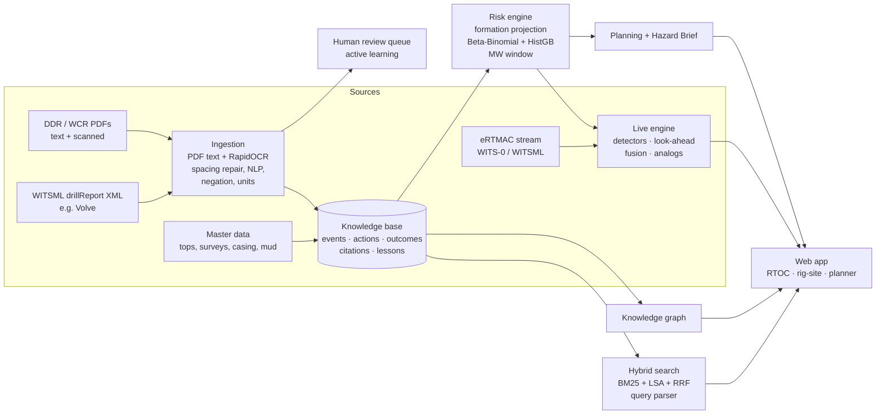

# eRTMAC-NWIS: Solution Design

**Nearby Wells Intelligence System: offset-well institutional memory that speaks up *before* the bit gets there.**
SIH 2026 · Problem Statement 26121 · Oil India Limited · Smart Automation

> **In one line:** NWIS reads every DDR, WCR and legacy scan, turns them into cited events, and projects the offset wells' problems onto the active well **by formation, not measured depth**. Engineers get a warning ~150 m ahead, with the source page, and a ranked list of what actually worked last time.

See [`RESEARCH.md`](RESEARCH.md) for the market and literature analysis that drove these choices, and [`VISION.md`](VISION.md) for the end state this prototype is building towards.

---

## 1. Who uses it, and for what

| User | Question they have today | What NWIS gives them |
|---|---|---|
| **RTOC / eRTMAC engineer** | "Is this flow-out drop the Tipam thief sand the offsets talked about?" | One fused alert feed: real-time detectors, formation-aligned offset look-ahead and mud-window checks. Each alert carries offset evidence, source pages and analogs. |
| **Rig-site company man** | "What do I do *now*?" | Rig-site view: bit depth, formation, one big alert, and the top actions with their historical cure rate. |
| **Well planner** | "What will this location throw at us, section by section?" | Risk-by-depth ribbon with credible intervals, the offset-derived mud-weight window, predicted tops ±σ, and a printable Offset Hazard Brief (DWOP pack). |
| **Knowledge owner** | "Where is that 2009 report about the Sylhet losses?" | Search and Ask with automatic filter parsing, a knowledge graph, and a review queue for low-confidence extractions. |

## 2. Architecture

- **Backend:** Python 3.10+ (tested up to 3.14) with FastAPI, REST plus a WebSocket at `/ws/live`.
  - Storage is SQLite, so there's nothing to install for the demo; PostgreSQL + PostGIS in production.
  - Analytics libraries: scikit-learn, SciPy, NumPy.
  - PDF handling is PyMuPDF. OCR is RapidOCR (ONNX, pip-only; `rapidocr-onnxruntime` 1.x up to Python 3.12, `rapidocr` 3.x on newer Pythons), with Tesseract as a fallback.
- **Frontend:** React 18 + TypeScript (Vite), Leaflet for the map, custom SVG charts, and d3-force for the graph.
- **Air-gapped by design:** no cloud APIs. The optional LLM is a local Ollama, off by default. It may only rephrase retrieved facts, and a **citation guard** drops any sentence without a valid citation.

## 3. What makes it different (and how each piece works)

### 3.1 Formation-aligned look-ahead
Hazards live in formations, whose tops shift by hundreds of metres across structures. The look-ahead works in four steps:
1. **Interpolate tops.** The target's tops are interpolated from offsets using inverse-distance weighting, `w = 1/(d² + 0.25)`. Uncertainty is `σ = weighted spread + 6 m + 3 m·d_min`.
2. **Project each offset event.** An event at relative position `r` inside formation F is placed at `top'(F) + r·thickness'(F)`.
3. **Convert to MD.** The projected TVD becomes MD along the planned trajectory, using minimum curvature.
4. **Cluster and score.** Projected events are clustered into **zones**. Each zone's probability is the weighted share of *exposed* offsets that had the hazard.

While drilling, each penetrated top is picked (mud-logger style, with lag) and everything deeper is re-anchored. In the demo, the Tipam top came in 11 m off prognosis and the look-ahead shifted automatically.

### 3.2 Uncertainty-aware risk ribbon
For each 25 m bin and each hazard:
- The prior is `Beta(2·p₀, 2·(1-p₀))`, where `p₀` is the basin rate for that formation window.
- **Weights:** each offset's weight is its distance kernel `exp(-d/3.5 km)`, times 1.5 if it's in the same structure, times recency `0.35 + 0.65·exp(-age/15 y)` (Tipam depletion makes newer wells more relevant), times data quality.
- **Censoring:** only offsets that **drilled that interval** count as exposures. A well that stopped above it tells you nothing.
- **Output:** the mean, a 90% credible interval, and the evidence count, so thin evidence *looks* thin.

A HistGradientBoosting model is stacked on top. It uses evidence features plus planned MW/ECD, inclination, mud system, spud year and distance to the Naga thrust. The blend weight between evidence and model is chosen per hazard by cross-validation. Occlusion explanations give the drivers, e.g. "mud weight/ECD +68 pts".

### 3.3 Probabilistic, offset-derived mud-weight window
Offset outcomes are censored pressure evidence:
- losses at ECD x ⇒ loss gradient ≤ x
- no losses ⇒ loss gradient > x
- kicks at MW x ⇒ pore pressure ≥ x

Weighted logistic curves per formation give `P(loss | ECD)`, `P(kick | MW)` and `P(instability | MW)`. The loss curve is **depletion-aware** because spud year is a covariate, and it is evaluated at the target's year. Losses to natural fractures or unconsolidated sand are separated out and flagged "not MW-controlled: plan LCM". The live engine checks the current MW/ECD against this window.

### 3.4 Physics-informed real-time detectors
Each detector reports the channels that drove it:

| Detector | Signals |
|---|---|
| Kick | Flow-out delta over baseline (the earliest indicator), pit-gain trend over 15 minutes, gas, pump-state gating |
| Losses | Flow-out drop plus pit-loss rate, classed as seepage, partial or severe |
| Stuck-pipe risk index | Torque ratio, overpull at connections against an expected hook-load trend, SPP pack-off spikes, torque variability |
| Overpressure | Corrected d-exponent departing from a normal-compaction trend, plus background-gas ratio |
| Torque spikes | Robust z-score |

Baselines are robust rolling medians. They reset after a mud-weight change or a formation top, where lithology shifts dxc.

### 3.5 Alert fusion (anti-alarm-fatigue)
- **De-duplication and lifecycle:** keyed alerts, hysteresis, 15-minute auto-clear and a 30-minute cool-down.
- **Corroboration:** when a symptom fires inside an active look-ahead zone, it escalates to **CRITICAL · CORROBORATED**, with confidence `1-(1-p_sensor)(1-p_offsets)`.
- **Feedback:** engineers can acknowledge an alert or mark it useful or a false alarm.

### 3.6 "What worked" recommendations and Analog Replay
- **Mitigation ranking:** mitigations are ranked by *outcome*, not habit. The measures are Laplace-smoothed cure rate, first-try success and median NPT, over offset events in the same formation, widening to the basin when evidence is thin.
- **What the data rediscovers:** fine LCM fails in fractured Sylhet (1/11) while cement plugs work (2/2). Sized CaCO₃ works in depleted Tipam.
- **Case-mix adjustment:** raw cure rates are confounded, because cement plugs go on total losses and on cases where other treatments already failed. Each action is therefore ranked by an **indirectly standardised** cure rate: what it achieved compared with what an average treatment achieved on cases of the same severity and attempt order, shrunk toward the overall rate when attempts are few. Two lucky attempts cannot claim a 97% cure rate, and a ⚖ marks actions whose raw and adjusted rates differ a lot.
- **Analog Replay:** a modern, fully automatic take on case-based reasoning. Every 30 m window of every offset log is a case. The live window is matched by kNN, and NWIS shows **what happened next** (≤60 m), with sources. The case index is cached on disk under a signature of every offset log and offset event, so the server starts without rebuilding it, and any new ingest invalidates it automatically.

### 3.7 Evidence-grounded document understanding
- **Records and sentence roles:** reports are segmented into time-log records. Each sentence gets a role: *event, action, outcome, negated, hypothetical, lesson*.
  - Negation handling means "No losses observed" and "LOSSES: NIL" are not events.
  - Hypothetical handling means "Precautionary LCM kept ready" and "anticipated losses" are not events.
- **Units** are normalised: m/ft, ppg/SG/pcf, bbl/hr and m³/hr, klbs/t.
- **Hazard classification** is an ensemble of a domain lexicon (specific terms win: "losses during cementing" is CEMENT, not LOSS) and a TF-IDF + logistic-regression sentence classifier.
- **OCR path:** the page is cut into strips at blank rows and RapidOCR detects the text lines in each strip. Each line is then recognised on its own from a padded, upright crop, **without the angle classifier**: the classifier flipped long full-width report lines to 180° and they came back empty, and tight crops made the recogniser drop word spaces. After that come digit repair inside numbers ("3,21l m" → "3,211 m", "1,O45" → "1,045", never touching words) and domain word-segmentation for any spaces still missing. Section headings and report types are matched whitespace-tolerantly ("2.CASINGPOLICY").
- **Scans stored before OCR was installed.** Without an OCR engine a scanned page is kept, flagged and left unread rather than rejected. Ingestion lists these documents, and one click (or `python -m nwis.cli reread-scans`) re-reads them through OCR once it is installed. `python -m nwis.cli evaluate-ocr` re-scores scan recall without a full rebuild.
- **Casing-shoe depths:** a cementing sentence that names its string ("cementing of 9-5/8\" casing") is placed at that string's shoe from master data. On poor scans a lost bullet dash can merge two complications into one record, and this stops the cementing event from borrowing the other one's depth.
- **Consolidation:** events are merged across days and documents, keeping all citations.
- **Confidence:** confidence below 0.7 routes an event to the review queue. Approvals become new training sentences (active learning).

### 3.8 Query understanding without an LLM
"losses in Tipam within 5 km after 2012" becomes the chips `[Lost circulation] [Tipam Sandstone] [within 5 km] [2012–…]`. Retrieval is hybrid BM25 with drilling synonyms plus LSA semantic search, fused with Reciprocal Rank Fusion. "Ask NWIS" returns statistics (k of n wells, depth range, NPT, what worked) and numbered citations.

### 3.9 Planning ↔ execution in one model
The Offset Hazard Brief uses the same zones, window and recommendations that arm the live alerts. It includes a **watch-list** of what NWIS will monitor for that well. This directly targets the "mismatch between planning and execution" cited after Baghjan-2020.

### 3.10 Built for OIL
- On-prem and offline, with an offline basemap fallback.
- WITS-0 parser and WITSML 1.4 drillReport importer (Volve-compatible).
- Integrates through a stream-source adapter next to eRTMAC; no rip-and-replace.
- Separate rig-site and RTOC views.

### 3.11 Alarm budget: physics baselines and conformal calibration
- **Physics baselines.** Expected standpipe pressure, ECD, hookload and torque come from simplified hydraulics and soft-string torque-and-drag. They use depth, inclination, mud weight and flow rate, and the friction-factor-like coefficients are calibrated online on quiet drilling. Unlike rolling medians, the expectation follows depth and responds immediately to a mud-weight change. Live Ops draws it as a dashed "physics expected" line.
- **Conformal p-values.** Each detector keeps a reservoir of its own recent normal scores, averaged over its persistence window. A sample only joins the reservoir after about 2.5 h, and only if no alert followed, so the run-up to a real problem is never learnt as normal. Every alert shows its p-value.
- **Budget, ISA-18.2 style.** The RTOC sets how many non-critical alerts per hour it can act on (0.5, 1, 2 or 4).
  - Critical alerts, and alerts corroborated by an offset look-ahead zone, always show.
  - Over budget, weaker signals are held in a visible **digest** and logged. Nothing is silently dropped.

### 3.12 Automatic formation-top picking (DTW)
- **Method.** For the next formation, each nearby offset provides a template: its smoothed gamma-ray from 80 m above to 40 m below its top.
  - Open-begin/open-end dynamic time warping maps the offset's top onto the live GR log.
  - A pick needs at least 3 offsets to agree within 15 m, the pick must lie inside the ±2σ prognosis, and the GR must step across it the same way as in the offsets.
- **Modes.** `NWIS_TOP_PICK=auto` (default) keeps the mud-logger pick in charge and runs DTW as an independent QC; a disagreement above 15 m raises a *correlation conflict* note. `dtw` re-anchors on DTW alone; `mudlogger` switches it off.

### 3.13 Decision black box
Every alert opening, escalation, acknowledgement (with the person's name), clearance, engineer verdict (useful, false alarm, or real but not actionable), digest hold and budget change goes to an append-only `decision_log`. Each row stores the SHA-256 of the previous hash plus its own content, so editing or deleting any past row breaks verification. The alert drawer shows the trail for that alert, and Analytics shows chain status. This answers the question every post-incident review asks: what did the console show, when, and who acted?

### 3.14 What-if planner
Planners edit mud weight, ECD or casing-shoe depth per section and the offset models re-run on a copy of the plan. The planner reports formation-level risk deltas and the mud-window findings, and draws the scenario on the MW-window chart. It says plainly that offset-evidence probabilities do not depend on planned mud weight: only the ML layer and the window checks move.

### 3.15 Institutional memory: expert memos, after-action reviews, shift handover
- **Expert memos.** Senior engineers type a memo or record it as a voice note in Assamese, Hindi or English.
  - Voice is transcribed on-prem through the optional `nwis[asr]` extra, which uses faster-whisper.
  - The memo runs through the same NLP and is credited to its author. **Everything from a memo goes to peer review** before it can influence alerts or rankings.
- **After-action reviews.** Any event in Knowledge search can produce a cited review. It covers what happened, a timeline from the report pages, the actions and outcomes, what the case-mix-adjusted offset evidence says, and similar events. An engineer approves it into a first-class lesson.
- **Shift handover.** One click in Live Ops produces a cited brief of the last 12 h:
  - progress and top picks
  - the alerts and how they were handled
  - open items
  - hazard zones in the next 300 m, with what worked
- **Grounding.** Both documents are extractive. The optional on-prem LLM may only rephrase them under the citation guard.

### 3.16 Live rig-feed adapter (next to eRTMAC)
- **Protocols.** `NWIS_STREAM` selects the feed:
  - `wits0-listen:PORT`: NWIS listens and the rig or eRTMAC relay pushes WITS-0 over TCP.
  - `wits0-connect:HOST:PORT`: NWIS connects to a serial-over-IP WITS box.
  - `witsml:https://…`: NWIS polls a WITSML 1.4.1 store's time log with `WMLS_GetFromStore`.
  - `replay` (default): the stored stream, as before.
- **Robust decoding.** An incremental decoder reassembles packets split across TCP reads and skips garbage bytes and bad lines. Connections reconnect with exponential back-off, because VSAT links drop.
- **Channel mapping.** WITS Record 01 codes are mapped directly. Gamma ray and ECD use configurable extension items (`NWIS_WITS_MAP`) to be confirmed with OIL's mud-logging vendor, and WITSML mnemonics are configurable too (`NWIS_WITSML_MAP`).
- **Normalisation.** A real feed does not carry everything the replay has, so NWIS fills the gaps and says which channels it derived:
  - TVD comes from the planned trajectory.
  - Rig state is inferred from pumps and ROP.
  - The d-exponent is computed from ROP, RPM, WOB, bit size and MW.
  - ECD is estimated from MW plus the planned annular margin when the rig does not send it.
  - Formation tops are re-anchored by gamma-ray DTW, because a raw feed has no mud-logger picks.
- **One shared session.** Every console (RTOC wall, duty engineer, rig tablet) sees the same alerts, and an acknowledgement on one is visible on all. The topbar shows packet health.
- **Stream gaps.** A feed that goes quiet for longer than `NWIS_STREAM_GAP_S` raises a *stream gap* banner and event: alerts are frozen at the last bit depth, not silently stale.
- **Rig simulator.** `python -m nwis.cli simulate-rig --connect 127.0.0.1:5501` sends the stored well as real WITS-0 frames. It sends only what a rig WITS box would send, never state, d-exponent or hidden formation.

### 3.17 Real-data check on public Equinor Volve reports
- **Command.** `python -m nwis.cli validate-volve <folder>` scores NWIS on the public Volve daily drilling reports (WITSML drillReport XML, 1,759 report-days).
- **Scoring.** NWIS reads the **free text only**: operator codes and NPT tags are stripped, so the labels cannot leak. The operator's own activity codes are the labels, so results are **agreement with operator coding**, not hand-checked truth.
- **Local adaptation.** The first result is zero-shot transfer from the synthetic-trained classifier. Then NWIS re-fits with k = 20, 60 and 140 labelled local report-days from *other* wells and re-scores held-out wells. This is the DrillScribe finding (see VISION.md) turned into a routine check.
- **Status.** Volve must be downloaded after accepting Equinor's licence, so real numbers appear in Analytics only after that run. The pipeline is tested on a synthetic Volve-format fixture.

### 3.18 Sign-in and roles
- **Accounts.** Users sign in. Passwords are stored as salted PBKDF2-SHA256 hashes, and the session is an HMAC-signed, HttpOnly cookie valid for 24 hours, so a rig tablet lasts a tour plus handover. Everything is Python standard library, with no external identity service needed on an air-gapped network. SSO/LDAP is on the roadmap (§7).
- **Roles.** One policy table (`auth.RULES`) is enforced by a middleware on every `/api/*` call and on the live WebSocket, so an endpoint cannot forget its check. The UI hides what a role cannot use.

| Role | Can use |
|---|---|
| **field** (driller, rig site) | Live Ops and the rig view, alert acknowledgement and feedback, Offset Map, Correlation, Risk & Planning (read), Knowledge, expert memos |
| **office** (drilling engineer, RTOC) | All of the above, plus document ingestion, the review queue, after-action review approval, the what-if planner and Analytics |
| **admin** | All of the above, plus user management and decision-log chain verification |

- **Accountability.** The decision log records the **signed-in user** for acknowledgements, verdicts, memo authorship, review decisions and after-action approvals. It no longer trusts a name typed in the browser. Sign-ins and review decisions are logged too.
- **Demo.** `build-demo` seeds `field`, `office` and `admin` (password `demo`), and the sign-in page offers them as one-click shortcuts. `NWIS_AUTH=off` turns sign-in off for development.

### 3.19 Rig-site offline app
- **Install.** `#/rig` is a full-screen, large-type view that installs as an app from `manifest.webmanifest`.
- **Offline shell.** A service worker precaches the app shell and serves it with no server. A few read-only API calls fall back to their cached copies.
- **Offline picture.** The live picture (bit depth, formation, next top, MW/ECD against the window, the top alert and what worked) is kept on the device. With the link down it is shown under an **OFFLINE: last known picture from HH:MM** banner.
- **Queued acknowledgements.** Acknowledgements made offline are queued on the device and delivered on reconnect, carrying the original time, `acted_at` and `queued_offline`. If the alert no longer exists on the server, the action is still written to the decision log and marked `unmatched`.

### 3.20 Real public-data mode (Norwegian North Sea)
- **Why.** OIL's nine data sources are internal, so a second, real knowledge base checks that the pipeline works on genuine records, not only on data it generated itself. [`DATA_SOURCES.md`](DATA_SOURCES.md) maps each OIL source to its public stand-in.
- **Build.** `./run.sh --public` (or `python -m nwis.cli build-public --download --quadrants 15,16` with `NWIS_REGION=norway` and a separate `NWIS_DATA_DIR`) fetches five Sodir FactPages CSV exports once, caches them for offline use, and loads near-vertical exploration wellbores with their lithostratigraphic tops, casing, mud weights and LOT/FIT tests. The wellbore-history narratives run through the same NLP pipeline as DDRs and WCRs.
- **Region.** `NWIS_REGION=norway` swaps the Upper-Assam stratigraphy for North Sea groups (Nordland … Hegre); well-known formation names map to their group, e.g. Draupne → Viking.
- **Scale (quadrants 15 and 16, the Sleipner / Volve / Utsira High area).** 173 wellbores, 170 wellbore histories, 1,145 group tops, 817 hole sections, 339 LOT/FIT tests and about 90 extracted events, all cited to the history they came from.
- **Licence.** NLOD 2.0. The required attribution is stored with the build and given in `DATA_SOURCES.md`.

## 4. Measured results (synthetic Upper-Assam dataset, reproducible)

`python -m nwis.cli build-demo` generates the data. It is deterministic (seed 26121) and takes about 2 minutes, or about 8 minutes on a 4-core machine when an OCR engine is installed, because the scanned-report evaluation then runs too. It produces **59 offset wells, 118 PDFs (4 scanned), 2,100+ pages, 132 extracted events (against 132 true events), 123 lessons, and 1,100+ citations**.

| Capability | Metric | Result |
|---|---|---|
| Event extraction, **held-out phrasing** (ALL-CAPS rig shorthand, different units, never seen by the classifier; 14 DDRs, 30 true events) | Precision / Recall / F1 | **1.00 / 0.87 / 0.93** |
| | Formation accuracy · depth MAE · mitigation Jaccard | 1.00 · 0.6 m · 1.00 |
| Scanned WCRs (the same 12 reports as text PDFs and as scans → OCR → NLP; 32 true events) | Event recall · precision, text PDF (ceiling) | 1.00 · 1.00 |
| | Standard scan (200 dpi, slight skew, noise) | **1.00 · 1.00**, 4% of characters differ from the text layer, depth MAE 0.5 m |
| | Poor scan (150 dpi photocopy, 1° skew, heavy noise) | **1.00 · 1.00**, formation accuracy 1.00, depth MAE 0.5 m (RapidOCR 3.x, PP-OCRv6; the older rapidocr-onnxruntime 1.x scored 0.97 · 0.97 with formation accuracy 0.77, from merged records on lost bullets) |
| Risk prediction, leave-wells-out, features from *earlier* wells only; pooled ROC-AUC | Nearest offset well (typical manual practice) | 0.583 |
| | Formation base rate | 0.833 |
| | Offset evidence (Beta-Binomial) | 0.838 |
| | **ML model (HistGB)** | **0.896** |
| Mud-weight window | Tipam loss P50 for the active well vs latent truth (10.0 ppg) | **10.0 ppg** (depletion-aware fit) |
| Live replay of NDH-21 | Hidden hazards detected | **4 / 4** |
| | …preceded by a formation-aligned look-ahead ~150 m earlier | 3 / 4 (Tipam losses, Barail kick, Sylhet losses) |
| | Overpressure early warning (dxc + gas) | Fires about 50 m before the kick |
| Alarm budget, nuisance stress replay (pit transfers, flow surges, gas and stick-slip bursts injected; 114 h) | False alarms, no budget → budget 1/h | **14 → 9**, still **4 / 4** hazards detected; 0 false alarms on the clean stream |
| DTW top picking, no mud-logger picks | Median / mean / worst error vs hidden tops (4 tops) | **8 m** / 17 m / 49 m (Tipam, fooled by a sand streak in the Girujan clay); still **4 / 4** hazards detected |
| Live WITS-0 feed over TCP (simulator → listener → shared session) | S1 losses on the live path; derived channels | **Detected and corroborated**; state, d-exponent and TVD inferred (not sent by the rig); DTW re-anchored the Tipam top live |
| Rig-site offline app | Server stopped, page reloaded | App shell and last picture served offline; queued acknowledgement logged after reconnect with `queued_offline` |
| Case-mix-adjusted mitigation ranking | Toy case with severity confounding (unit test) | Adjustment removes more than half of the raw bias |

**Honesty note:** these numbers validate the *pipeline mechanics* on synthetic data with known ground truth, which is why they can be measured at all. They are not field performance. The first pilot step is to re-measure them on OIL's own DDR/WCR archive (§7).

`pytest` (69 tests) enforces these claims, as well as unit parsing, negation, minimum curvature, WITS-0 and WITSML parsing, the API/WebSocket surface, decision-log tamper detection, conformal false-alarm rates, physics baselines, DTW alignment, what-if isolation, memo peer review, after-action reviews, the handover brief, OCR repairs, scan recall, re-reading scans stored before OCR was installed, and sign-in with role enforcement. The live-alerting numbers come from `python -m nwis.cli evaluate-live`, which `build-demo` also runs.

## 5. Seven-minute demo script (for judges)

0. **Sign in (10 s)** as `office` (one click on the sign-in page). Mention that a `field` account sees a smaller menu and that every acknowledgement is logged under the signed-in name.
1. **Live Ops (2 min).** "This is NDH-21 drilling in Namdang High. The ribbon is the next 320 m." Click **S1**.
   - The Tipam top is picked and the look-ahead re-anchors (Geology events panel).
   - A mud-window alert fires: *ECD ≈10.6 ppg gives P(loss) ≈65% in Tipam*.
   - Look-ahead: *Bit 150 m above the interval where 4 of 15 offsets lost returns*.
   - Flow-out drops and the pit falls, and the alert becomes **CRITICAL · CORROBORATED**.
2. **Evidence drawer (1 min).** Click the alert. Walk through why (the signals), which offsets, and "→ here" (projected by formation). Click `p.20` to open the exact DDR sentence, highlighted. Then show "What worked" (coarse LCM 2/2, ✔) and the analogs.
3. **Rig-site view (20 s).** Show the big-font single instruction.
4. **S3 (40 s).** Show dxc reversal plus gas, then the overpressure warning, then the kick detected and corroborated.
5. **Risk & Planning (1 min).** Show the heatmap, the headline zones with CIs, and the MW window chart (planned MW left of the orange kick bound in Barail). Click **Generate Offset Hazard Brief**.
6. **Knowledge (1 min).** Type "losses in Tipam within 5 km after 2012" and show the parsed chips. Then Ask NWIS "What worked for losses in Sylhet?" and click a citation.
7. **Ingestion (40 s).** Load *Today's DDR*.
   - It shows negation and hypothetical sentences being ignored, and two events auto-accepted.
   - Then load the *Scanned legacy WCR* to show OCR.
8. **Analytics (20 s).** Show AUC against the baselines and extraction F1, and close with the value calculator.
9. **Vision features (2 min, if time allows).**
   - **Live Ops:**
     - Point at the dashed *physics expected* lines.
     - Switch the alarm budget to 0.5/h and show the *Held in digest* card.
     - Acknowledge the S1 alert and show the **decision log** in the drawer.
     - Click **Handover brief**.
   - **Risk & Planning:** in the what-if planner, drop the 12¼″ ECD to 10.0 ppg and show Tipam loss risk falling by about 8 points.
   - **Knowledge:** open **After-action review** on a Sylhet loss.
   - **Ingestion:** submit an expert memo and approve it from the review queue.
10. **Live rig feed (1 min).**
    - Start the server with `NWIS_STREAM=wits0-listen:5501`, then run `python -m nwis.cli simulate-rig --connect 127.0.0.1:5501 --speed 600 --from-md 2118`.
    - Switch Live Ops to **● Live rig feed**. The topbar shows *LIVE · WITS-0* with packet health, and the S1 losses fire from real WITS-0 frames.
    - Open `#/rig` on a tablet and stop the server. The rig view stays up under an OFFLINE banner. Acknowledge the alert, restart the server, and the queued acknowledgement appears in the decision log.

## 6. Feasibility and deployment at OIL

- **Hardware:** one on-prem server, 8 cores and 16 GB, handles hundreds of wells. OCR throughput is about 6–10 pages/minute per core, and a legacy archive is a one-time batch.
- **Integration:**
  - The live stream comes from eRTMAC via WITS-0 over TCP (listen or connect) or WITSML 1.4.1 log polling, both built (§3.16). The item and mnemonic maps are configuration, not code.
  - Master data (tops, surveys, casing, mud) comes from existing drilling databases.
  - Documents come from the DMS or file shares.
- **Security:** no internet egress required. Sign-in with field / office / admin roles is enforced on every API call (§3.18), and every extracted fact is traceable to page and character span for audit.
- **Cost:** open-source stack, with no per-seat licences, unlike DELFI, DecisionSpace or SiteCom.
- **Value (editable in Analytics):** NPT hours × rig spread rate × avoidable fraction. OIL sets the inputs; the prototype makes the assumptions explicit.

## 7. Roadmap after SIH

The staged path to full deployment, with exit criteria and target metrics, is in [`VISION.md` §8](VISION.md#8-staged-path-to-the-end-goal).

1. **Pilot on real data:** ingest 3–5 years of OIL DDR/WCR for one field. Re-measure extraction F1 and risk AUC, and calibrate detector thresholds with RTOC feedback.
2. **Top correlation on real LWD:** DTW picking is built (§3.12). Next, tune it on OIL's gamma-ray logs, add ROP and resistivity as extra channels, and use it to catch sand-streak mis-picks before trusting `dtw` mode.
3. **Full physics models:** replace the simplified hydraulics and soft-string baselines (§3.11) with calibrated stiff-string torque-and-drag and transient hydraulics (OpenLab-class).
4. **On-prem LLM assistant:** Ollama with the citation guard rephrasing the extractive handover and after-action reviews (§3.15). Both already work without it.
5. **Production data layer:** PostGIS, SSO/LDAP, an off-server copy of the decision-log hash head, and a mobile rig-site client.
6. **Closed-loop learning:** every new DDR of the active well is ingested daily, so today's well becomes tomorrow's offset.

## 8. Known limitations (stated up-front)

- **Data.** The demo is synthetic because OIL's nine data sources are internal. It is calibrated to published Assam geology, so the metrics are about mechanism, not field accuracy. A real public-data mode (§3.20) runs the same pipeline on genuine wells, tops, casing, mud and incident histories; [`DATA_SOURCES.md`](DATA_SOURCES.md) also explains how to request real Assam data from DGH's National Data Repository.
- **Public-data mode is a pipeline check, not a skill measurement.** Sodir histories are summaries, so incidents are under-reported (8 loss and 10 kick events across 173 wells in quadrants 15–16). With that few positives the leave-wells-out risk AUCs are not meaningful, ECD is approximated as mud weight + 0.3 ppg, and only near-vertical wells are used, so MD is treated as TVD. North Sea geology is not Assam.
- OCR is measured on synthetic scans (a clean 200-dpi scan and a 150-dpi photocopy), not on OIL's archive. Handwriting, stamps over text, tables with ruled grids and faded carbon copies are not in the test set. The design compensates with confidence scores, the review queue and cross-document consolidation, since DDRs usually repeat what the WCR says.
- Sign-in uses local accounts stored in the NWIS database. Production would federate with OIL's directory (SSO/LDAP), and the session secret should be set explicitly (`NWIS_SECRET`) when more than one server shares users.
- The stuck-pipe ML model underperforms the base rate in cross-validation (0.68 vs 0.78 AUC). The blend therefore gives it weight 0, so stuck-pipe risk comes from offset evidence and the real-time risk index.
- The alarm budget only trims non-critical alerts. Most remaining nuisance false alarms in the stress test are critical-level pit-transfer "losses", which it deliberately never hides. A pit-transfer flag from the rig would remove them.
- DTW picked the Tipam top 49 m early because a sand streak sits inside the Girujan clay. That is why the default mode uses DTW as a QC beside the mud logger and not as the sole source.
- Narrative, first-person memos rarely yield structured events. They are captured as attributed lesson candidates for peer review.
- Voice memos need the optional speech model installed and its weights cached on the server. Out-of-the-box Whisper accuracy on Assamese is limited.
